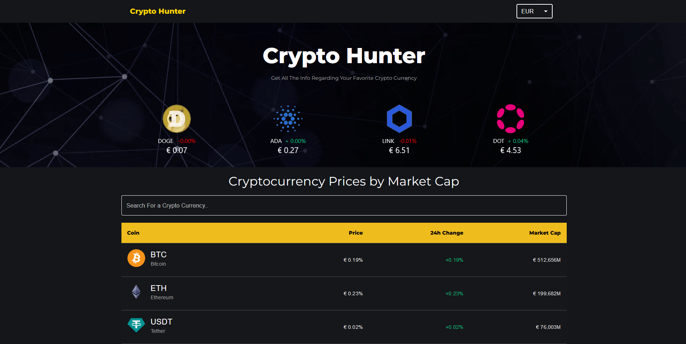

# Cryptocurrency Information Website - React Project

The Cryptocurrency Information Website is a web application built using React that provides users with real-time information about various cryptocurrencies. Whether you're a crypto enthusiast, investor, or just curious about the market, this app offers a platform to explore cryptocurrency prices, trends, and news.

# Features

    Cryptocurrency Listings: Display a list of popular cryptocurrencies with their current prices, market cap, and 24-hour price change. Fetch data from a cryptocurrency API to keep the information up to date.

    Detailed Cryptocurrency Pages: Create separate pages for each cryptocurrency to display detailed information, historical price charts, and additional data.

    News and Updates: Integrate a news API to display the latest news and updates related to the cryptocurrency market.

# Technologies Used

    Frontend: React.js for building dynamic and interactive user interfaces.

    API Integration: Utilize cryptocurrency APIs (such as CoinGecko API or CoinMarketCap API) to fetch real-time cryptocurrency data and news.

    Styling: CSS for designing a visually appealing and user-friendly interface.

# Installation and Usage

To run the Cryptocurrency Information Website locally, follow these steps:

    Clone this repository to your local machine.
    Navigate to the project directory and install dependencies using npm install.
    Sign up on a cryptocurrency data provider (e.g., CoinGecko) to obtain an API key.
    Implement the necessary API calls and components to display cryptocurrency data and news.
    Run the development server using npm start.
    Access the app in your browser at http://localhost:3000.
